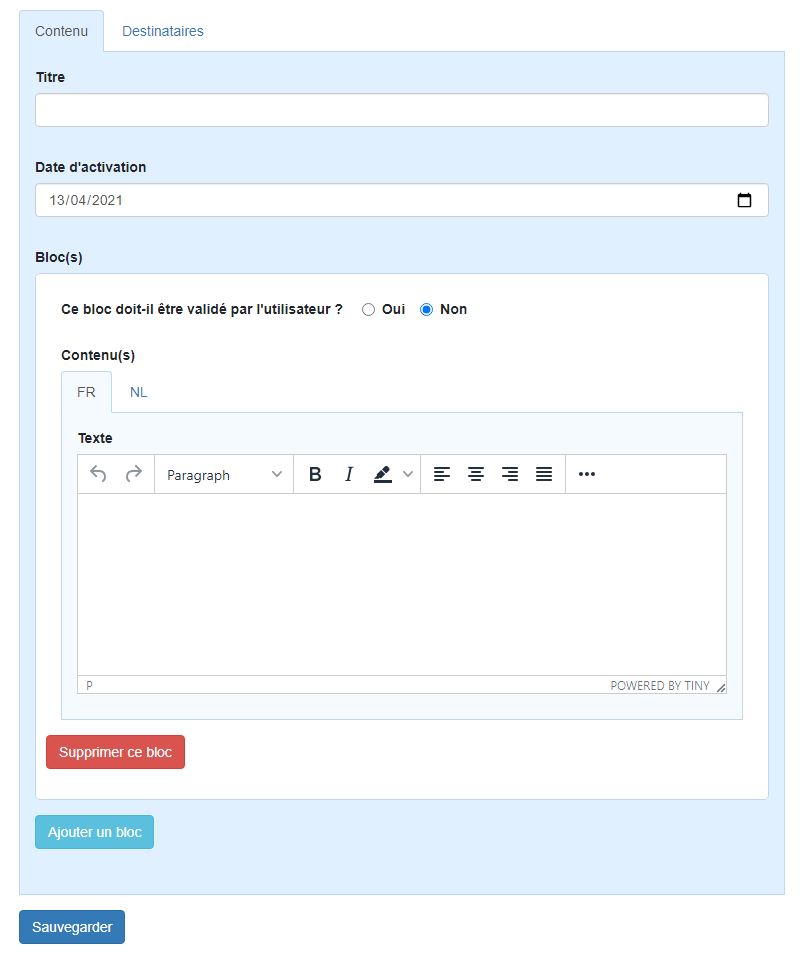

# symfony-test

A partir du squelette Symfony fourni, il vous est demandé de créer une version simplifiée du formulaire ci-dessous que nous utilisons dans notre application en production.
Il s'agit d'un formulaire permettant d'encoder une notification destinée à être envoyée aux destinataires sélectionnés.

Pour simplifier le test, vous ne devez pas implémenter la partie des destinataires (les champs se trouvant dans l'onglet Destinataires ne sont d'ailleurs pas visibles).
Il n'est pas non plus demandé d'utiliser TinyMCE sur la zone de texte.

Voici les différents objets utilisés dans le formulaire que vous devez modéliser en entité:
 - Un objet **Notification** a un titre obligatoire, une date d'activation obligatoire et doit contenir au moins un objet **NotificationBlock**.
 - Un objet **NotificationBlock** a une valeur booléenne obligatoire représentée par 2 boutons radios et autant d'objets **NotificationBlockContent** qu'il y a de langues disponibles.
 - Un objet **NotificationBlockContent** possède une langue en format ISO (c-à-d en 2 lettres) et un texte obligatoire.

Pour le test, l'application possède les langues FR et NL mais l'ajout d'autres langues ne devra pas impliquer beaucoup de modification de code. Restez générique! ;)

Pour vous faciliter la tâche, il est vivement conseillé d'utiliser les outils suivants déjà installés:
 - MakerBundle
 - Bootstrap
 - jQuery

L'exercice doit se faire sans framework Javascript.

Remarquez sur l'aperçu la présence des boutons permettant d'ajouter/supprimer un bloc.

L'objectif du test est de manipuler dans un seul formulaire plusieurs objets liés entre eux.
Le formulaire de test comporte 3 objets liés: des **NotificationBlockContent** dans des **NotificationBlock** dans des **Notification**. 
A titre informatif, la version du formulaire en production comporte en réalité un 4ième niveau: des objets **NotificationFile** pouvant être ajoutés dans un objet **NotificationBlockContent**.

Nous attacherons également de l'importance à la manière dont vous effectuerez le rendu.

Conseil: ne vous lancez pas tête baissée dans la solution qui vous semble la plus rapide. Ce test a bien évidemment été mis en place pour vous faire mettre en application des fonctionnalités bien précises de Symfony adaptées à ce genre de situation.
